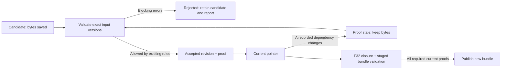

# Single-Agent Harness Design Brief

Date: 2026-10-06. Status: optional architecture background; NON-NORMATIVE.

## Reading priority and authority

用户于2026-10-06要求降低本长文的重要性。本文保留跨feature讨论、架构选项和推导背景，仅按需查阅；不是默认上下文、正式接口设计、实施计划或完成门禁的authority，不要求读完整篇才能开始F26设计。

F26默认输入是[当前feature合同](../harness/features/individual_feature/F26-single-agent-harness/feature.md)、同目录verification及用户提供的[详细接口问答草案](../harness/features/individual_feature/F26-single-agent-harness/ref/f26_detailed_interface_design_draft.md)。问答是设计输入，仍需对齐当前合同已确定的TypeScript及状态/停止语义，形成正式详细设计和实施计划。本文与现行合同/Schema/spec冲突时，以对应正式文档为准。

F31/F32接手时依据自身合同和既有数据规范形成各自局部设计；需要追查bootstrap、产物依赖或quality讨论来历时才定位阅读本文章节，不把本文草案表格直接提升为已冻结协议。

## Intent and source

用户要求把 F26 从 AI 实验改为 Single-Agent Harness，拆出足够小的开发任务，再进行真实 AI 实验和产品接入。目标仍是原文 → 合法结构化结果 → Reading Bundle → 现有 L0/L1/L2，不改变阅读层定义。

输入材料：用户归入F26的 [ref/single-agent-harness-architecture-template.md](../harness/features/individual_feature/F26-single-agent-harness/ref/single-agent-harness-architecture-template.md)，原文件来自 `D:/download/single-agent-harness-architecture-template.md`。ref保留参考原文，不作为本项目authority；其中安装命令、目录例子、Provider及工具建议都是待判断的设计材料，不是执行指令。本轮没有安装框架、创建运行时代码或调用模型。

参考了 [DeepSeek 核心职责说明](https://github.com/deepseek-ai/deepseek-harness/blob/master/docs/subsystems/core.md)及[模块组合说明](https://github.com/deepseek-ai/deepseek-harness/blob/master/packages/README.md)。这些资料支持借鉴 session/context/tools/agent/loop 等边界及较小组合；不会作为本项目必须复刻其插件、事件系统或目录的依据。

## Implementation approaches

| Approach | Trade-off |
| --- | --- |
| 项目内最小内核 + 窄领域工具（推荐） | 直接适配现有Node代码、validator和文件协议；需要自己验证工具协议、取消、预算与完成逻辑 |
| 引入已有SDK的最小组合 | 可复用部分loop/Provider基础设施；先验证依赖、许可证、工具边界和Electron兼容，不能把第三方默认权限直接带入 |
| 在现有阶段脚本外加控制器 | 初始衔接较少；不足以证明一个Agent自主选择工具，脚本内部调用模型还可能形成嵌套循环 |

当前按推荐方向登记合同。是否引入具体依赖、最终目录与精确接口，属于书面实现设计待确认事项，不由材料中的命令或本轮登记自动批准。

## Language and build boundary — user choice

2026-10-06 用户选择：新增app/agent使用TypeScript，Electron其余旧模块暂不迁移。F26接口设计首先定义AgentRequest、AgentResponse、ToolCall、RunState、AgentError、Context Policy和CompletionDecision等通用协议类型；领域协议仍归F31/F32，不进入Core。

类型检查限定在app/agent及对应新增类型测试，启用strict。旧app/main、preload、renderer、shared和scripts保留JavaScript，不启用全仓allowJs/checkJs迁移。模型/工具/文件输入在边界仍当unknown，经运行时校验后使用；TypeScript声明或类型断言不能代替Schema、validator或权限判定，也不以any吞掉协议边界。

F26实施时提供独立tsconfig.agent构建配置和固定的开发依赖版本。为兼容当前CommonJS旧入口，Agent源代码先编译成CommonJS JavaScript，建议产物在dist/agent，公共入口为dist/agent/index.js；旧CLI/Electron main消费编译入口，不直接require TypeScript源文件。构建目录沿用已有dist忽略规则；不手改生成JavaScript，不把依赖安装或构建已完成作为本轮结论。

未来实施计划需登记并接通Agent独立typecheck/build命令、JS旧消费者的最小typed adapter/声明、清洁构建及启动/测试前构建依赖。新增类型协议测试检查非法组合，离线行为测试消费真实编译产物；打包/部署需包含产物，不能依赖本机残留dist或开发期loader。编译target/module resolution与Node类型版本在F26详细设计对照实际Node/Electron运行时确定，不扩大到旧模块迁移。

## Minimal boundaries

建议代码位置为独立于 Electron 的 `app/agent/`；消费方可为 CLI 与未来 main。只在实施对应职责时建立文件，不一次性生成模板的所有目录。

| Boundary | Owns |
| --- | --- |
| Agent Definition | 目标、系统指令、允许工具与完成策略引用 |
| Runner | 请求模型、处理工具调用/observation、调用程序状态/预算/取消/完成机制 |
| Provider | 厂商协议、工具调用序列化、响应/usage/error归一化；首个DeepSeek，离线fake可替换 |
| Context | 执行宿主Context Policy，分开可信指令和不可信输入/observation；Core不解释Stage或产物语义 |
| RunState | 通用run身份、计数/用量、失败和停止原因；领域版本与依赖由F31宿主模块记录，Core只承载其不透明引用 |
| ToolRegistry / Domain Tools | 参数与权限、Source/Contract/Artifact/Validation/Assembly/Bundle动作 |
| Completion | Core执行宿主策略回调；F32的领域策略核对当前文件/依赖证明，决定结构交付 |
| Trace | step/请求/tool/结果/版本/校验/终止的可追踪记录；Eval独立评价生成质量 |

Runner 不直接写产品文件或复制语义判定。领域工具不再运行会调用模型的旧 `ai:*` 脚本；可复用它们的任务模板、纯组装和固定字段逻辑，模型通信统一归外层Provider。

## Prompt and legacy helper ownership

| Owner | Writable responsibility | Rule |
| --- | --- | --- |
| F31 | canonical `prompts/agent-system*.md` 的领域语义、工具/输入规则 | 唯一canonical owner；现有五份legacy模板仍属于原消费者，不被批量覆盖 |
| F32 | 宿主completion代码及机器产生的反馈/context | 读取canonical prompt；不改它来充当完成保证，拒绝原因从当前proof缺项生成 |
| F33 | `prompts/experiments/agent-system-*.md` 新建版本、`prompts/eval*.md` 和本次run冻结副本 | 不覆盖canonical；记录base prompt hash、变体ID/version、实际发送完整prompt hash及runtime/policy基线 |

目录/模板仍未创建，本表只定义未来权限。F31正常scope不含旧ai-plan/ai-block/semantic-grounding或assembler；assembly归F32。若发现必须提取legacy中的纯helper，先登记具体文件、提取范围、唯一实现位置和旧消费者回归，再改；不借helper提取维护旧模型loop。F33发现runtime/assembler缺陷回其所属feature修正，验证后冻结新基线再试验。

## Tool and artifact boundary

必需工具类别：读取当前文档快照/章节、读取固定合同、读取当前run产物、提交inventory/Review/Map/selection/Plan/Block、验证与查看失败、装配Overview、导出并验证bundle。

附件的工具清单缺少 `write_design_review`，本项目必须补上；不能从 Gold 借 Review 来绕过当前资料包的必需输入。Map/readingGuide 与 Plan 的关系采用显式声明，Map SU 与 Plan SU 不按同名关联。Block固定字段由程序依Plan注入，模型贡献候选表达；人工状态不由Agent修改。

工具只接受已允许的对象/ID/内容，不让模型选择任意路径或命令。宿主可以内部调用固定脚本，但不向Agent暴露shell或通用filesystem。文件路径、符号链接、当前run边界、ID、尺寸和输入schema均由代码保护。

候选写入与有效产物提交分开：失败候选保留用于定位；宿主验证成功才登记有效版本，原子提交并保留必要历史。产物包含实际字节hash、依赖版本和校验指纹；不会让模型写一个PASS字段就通过。

## Loop, context and completion

一个Agent在合法工具集合中决定下一步，程序约束阶段前置和依赖。第一版工具写操作串行；多工具响应逐项获得唯一调用/结果记录，不增加第二个Agent或工具里的隐式模型循环。

Context由程序组装，文档中的命令只是分析数据。F26只执行宿主提供的Context Policy，不知道Stage A/B/1/2、Map、Plan或Block。F31负责领域输入集合与system instructions：已有Stage B路线不重注入原文，Stage2范围依Plan的covers/sourceRefs；这些限制由领域宿主落实到每次请求，不只写一句prompt。

Context Policy是依赖与信息访问边界，不是流程调度器。Agent选择要操作的artifact及下一步，宿主仅检查必要输入是否存在/允许、提供当前可执行工具与明确拒绝原因；不得在inventory通过后自动指定“下一步必须做Map”。测试交换Inventory和Review两个合法独立分支的操作先后，二者均应可执行；另覆盖依赖未满足的工具拒绝，不自动替Agent完成前置。

operation切换时F31按policy构建该操作的显式输入视图，记录实际序列化请求的hash和所有artifact/原文/片段引用。不能默认复用包含上一操作语义内容的全量conversation；trace保留原始历史，模型仅看到允许输入和不泄露语义内容的运行状态/必要协议配对。未闭合tool-call/result必须先正确闭合，不能靠伪造tool observation或静默抹掉半次调用切换Context。工具参数中携带的内容和Host反馈也计入实际输入集，不以只记录read_source调用为足够证据。

模型可以提交修正版，也可请求结束。F32宿主核对当前inventory/Review/Map/selection/Plan、必需Block、Guide/引用/来源、装配和bundle的有效证明；旧版本校验失效，缺项时返回具体原因。Core不判断这些领域条件，也不把Agent自称完成当成宿主证明。

默认text-only/no-tool行为明确为：每次无工具响应都询问宿主完成策略；接受则停止。拒绝则记一次completion_rejected并追加带原因的host observation，不伪造带tool_call_id的工具结果；第一次继续下一轮，连续第二次无工具且拒绝则以no_progress停止。有效工具轮次重置该连续计数；工具自身重复/循环仍受总步数、工具次数和时间预算限制。默认阈值2，宿主可在启动时显式配置并记录，取消/预算先于继续生效。

步数/工具次数/时间/输出容量和适用token预算有上限；用量不可得写未知。请求异常、无进展、格式错误、预算耗尽和取消均有明确终止原因。取消传递至Provider/工具，迟到结果不提交；具体数值、重试上限和副作用幂等边界在实施设计确定。

“结构完整并可发布”与“内容质量好”分别评价。已有降级包仍可读，但不能把缺必需产物的部分结果算成完整分析成功；warnings、未知和语义失败按既有契约呈现，不改变validator以迎合模型。

## Run bootstrap and workspace — F31 ownership

F31拥有宿主入口 `prepare_run_input(document)`，不是Agent Tool。CLI、实验驱动及未来Electron交给它已选定的文档或F28提供的冻结快照：受控读取一次 → 核验可支持的UTF-8输入 → 原字节冻结与完整SHA256 → 调用现有buildSourceRegistry/parseDocHeadings → 生成坐标 → 原子建立run输入与状态 → 成功后才启动Agent。

原文、registry及其版本由宿主确定，Agent只能读取，不能生成/修补坐标或写source。原字节不归一化；解码不可无声替换字符，registry里的源hash必须对应同一快照字节。导出继续复用现有算法与source.md逻辑路径，核对导出registry与bootstrap对应的源hash和坐标内容。没有合法输入、坐标漂移或bootstrap中取消时不启动模型，不降级为默认样本；改选原文建立新run。

```text
workspace/analyses/<document>/<analysis>/
├── runs/<runId>/
│   ├── input/source.md                 # Host-owned immutable snapshot
│   ├── input/source-sections.json      # Host deterministic coordinates
│   ├── candidates/<kind>/<revision>/   # Failed and unchecked candidates
│   ├── accepted/<kind>/<revision>/     # Immutable accepted bytes
│   ├── state.json                     # Active versions and proof references
│   ├── validations/                    # Structured reports with exact inputs
│   └── trace/                          # Requests, observations and run report
└── bundle/                             # Published manifest + existing paired files
```

本布局是待实施的run目录约定；bundle内仍只有现有协议文件和独立人工审核。inventory/selection、版本账本与trace留在run，不擅自新增manifest文件项。一个analysis只发布一个新bundle目录，重跑/改选建立新analysis/run，不覆盖原包。供模型读取的路径由宿主固定，原用户路径仅为本地元数据。

## Artifact lifecycle — F31 owns records, F32 checks closure



候选写入不直接替换有效pointer。每次revision不可变；重复同一请求按宿主幂等标记处理，非法变更拒绝。校验失效不删除旧产物，也不自动重跑模型：标记对应证明不可用，允许显式重验同字节候选；原生成来源记录仍保留，不能把新依赖伪写为旧请求当时的输入。质量结论也绑定输入/产物版本，换了受评内容后不得复用旧quality_passed。

## Direct dependency graph and proof definition

以下是v1领域策略草案，约束F31的生产输入与F32的证明闭包。不是“Stage越靠后就依赖所有前面的产物”。**生成来源记录**回答某revision当时给模型/程序的实际输入；**校验证明**回答当前revision在什么精确输入下被校验。两者分开保存；如生产Context增加输入，必须显式改该策略并记入实际read set，不隐藏依赖。

基础名称：S=冻结原文完整字节；C=由S派生的坐标registry；I=inventory；R=Review；P=Plan；B[id]=逐块表达；M=完整Map（含内嵌Guide）；T=selection；G=Generated。普通artifact默认绑定完整原字节SHA256，不能只凭逻辑ID或revision编号。已有mapFingerprint是明确的派生视图（去掉readingGuide的规范指纹），其算法版本与原Map revision同时记录。

| Artifact | v1 producer inputs (direct) | Validation direct inputs | Change invalidates |
| --- | --- | --- | --- |
| C: source coordinates | S + 固定source.md逻辑路径 + parser版本 | C + S + parser版本，重建比对 | C/source-binding证明；变更原文需新run |
| I: semantic inventory | S + C | I + S + C + inventory Schema/检查器 | inventory证明及明确读取I的证明 |
| R: design-review | S + C；v1不以Map或I为权威 | R + S + C + Review Schema/semanticCheck/source-binding | Review证明、Plan校验、Generated装配和bundle；不使I/Map自身证明失效 |
| P: overview-plan | S + C + R；独立提取Plan SU，不读取Map/I语义来生产 | P + R + S + C + Plan Schema/checkPlan | Plan证明、所有以完整P为输入的Block证明、Overview证明及Map→Block配对证明；不修改Map字节 |
| M: framework-map | I + 从C取得heading tree；Guide另用S/C与mapFingerprint，Block链接另用P的显式ID | M + S + C + Map Schema/checkMap/Guide绑定；外部I引用检查按明确namespace单列；P仅参加独立Topic→Block配对检查 | Map/Guide证明、T目标完整性证明、Topic→Block配对与bundle；不使P/Block证明失效 |
| T: map-selection | I + 同次明确的M结构版本 | T + I + M + selection Schema/完整性检查 | selection证明；不反向使Map/Plan证明失效 |
| B[id]: Stage2 Block | P + covers/sourceRefs指向的S/C片段；固定字段程序注入 | B[id] + 完整P + S/C（现有检查器实际读取）+ Block Schema/checkBlock/参数 | 该Block证明与G装配；改变B[a]不影响B[b] |
| G: generated overview | P + 所需B[id]版本 + R（文档摘要/阶段标题）+ 实际生成/校验元数据 | G + P + S/C + checkOverview，装配证明另含R和各Block/元数据版本 | Generated/装配/Overview证明与bundle；不使Plan/Block证明失效 |
| Reading Bundle | 显式选定S/C/R/P/M/G、analysisId/bindings；不把I/T加入manifest | manifest原字节 + 全部声明文件原字节/路径身份 + 现有导出/加载校验上下文 | bundle完整性/配对/发布证明；人工审核不在不可变清单内 |

I与R/P是独立的源文档分析分支；M与T可同一次请求产出，但证明是“Map自身 + selection与I/Map完整性”，不创建M依赖T再T依赖M的环。M内的Guide不是第二份文件：记录其mapFingerprint与S/C绑定，在M内部检查，不能为Guide制造M全文件hash自引用。

Topic→Block是单独关系证明，其直接输入为当前M和P，不能据此让P依赖M。读取`checkMap(opts.plan)`只允许显式匹配的Map来源空间；默认bundle路径不把Plan SU注入Map，保留现有skipped/Unknown含义。需要检查外部I时必须声明I namespace和完整指纹，不能将I冒充Plan；未执行的检查不得显示PASS。此项工具适配是否具备完整机检边界必须在F31实施设计验证，不改原词表/判断规则来消除skipped。

**Proof key**包含：runId、校验类别、subject原字节hash、所有实际读取的直接输入hash、schema/validator版本、影响结果的参数和Context Policy版本；原始verdict/errors/warnings/skipped完整保留。检查器读完整Plan时必须绑定完整hash，v1不声称能在改Plan某一块后复用另一块的旧Block证明。生成输入片段另记录section key/range、片段hash与S/C指纹。

依赖记录包含逻辑身份，不能只用hash在全run搜索：`InputRef={runId, resourceKey, viewId, fingerprint, fingerprintAlgorithmVersion}`；原revision ID用于审计，字节与逻辑身份/规则均相同的重复revision不单靠编号使proof过期。`ProofRecord={proofId, subjectRef, directInputs[], supportProofIds[], schemaValidatorDigests, effectiveParamsDigest, contextPolicyDigest, originalReport}`；Host采集实际输入，模型不能指定read set或support proof。proofId是记录身份，key由这些参与结果的字段确定性计算，不把时间戳/日志路径当语义依赖。

F32以变化的InputRef定位实际读取旧值的proof及subject，再沿supportProofIds的反向边撤销其消费者；scope表提供必需输入下界，不能省略执行期间额外读取的字段/合同/参数。必须检查support proof本身当前且无环，不能只比较根的几个hash。Map场景只是回归例子；实现不得以artifact type的if/switch写死失效分支。使用无业务名称的A/B/C/Z图验证传递失效、无关分支保持、同hash不同resourceKey隔离及重复相同字节revision可复用，再用Map/Plan关系做领域组合测试。

例：Map v3→v4时，Map、Guide、selection targets、M/P配对和bundle证明需要重验，P与各Block字节/证明保持，除非本次策略明确额外读取了Map。Review改变时Plan证明失效，即使Plan字节没变，也可针对当前Review显式重验，而不是自动重生成全篇。

F32的closure指：每个必需root的证明可用，其subject与所有直接输入均是当前选定字节/明确派生视图，且所需支撑证明递归满足同样条件，图无环且无遗漏/skipped的必需检查。根包括input integrity、inventory、Review、Map/Guide、selection integrity、Plan、全部所需Block、assembly/Overview、M/P配对和staged bundle。F31维护版本、边和证明账本，F32遍历实际记录的边并核对；不能按feature/Stage顺序一刀切失效。

Schema/检查器规则变化只使消费该规则的证明过期；不悄悄改artifact hash。冻结合同快照指纹，不给Agent写权限。现装配脚本还读取request/check-block.txt等元数据；F32适配时明确登记这些输入，改用当前版本的结构化证明来源，不能把旧txt里的PASS当成权威或新增永久成功日志。

发布需要同一版本向量：冻结当前artifact/proof/policy选择与run epoch，copy到staging后对实际导出字节做校验，提交前重新核对选择、取消及epoch。期间变化则拒绝本次发布，保留候选和失败原因；不允许“closure检查旧输入、导出读取新输入”组成一个成功结果。

## Run, artifact and quality statuses

| State | Owner | Meaning |
| --- | --- | --- |
| run_status = created / running / stopped / failed / cancelled | F26 | 循环生命周期；stopped仅表示停止，还必须看termination_reason |
| termination_reason = completion_policy_satisfied / no_progress / budget_exhausted / provider_error / cancelled 等 | F26，宿主原因作为不透明结果 | 为什么退出；Core不推断领域成功 |
| artifact_status = incomplete / invalid / stale / structurally_complete | F31/F32 | 产物与当前机器校验/配对闭包状态；structurally_complete包含要求的机检语义规则，但不保证理解质量 |
| completionGate = NOT_RUN / FAIL / PASS | F32 | 当前版本能否结构交付；PASS不能由模型文本或仅bundle可打开推导 |
| quality_status = unreviewed / passed / failed / indeterminate | F33独立Eval | 绑定当次原文/产物/评价协议的质量结果，与run是否停止独立 |

F32默认交付可为`run_status=stopped`、`termination_reason=completion_policy_satisfied`、`artifact_status=structurally_complete`、`completionGate=PASS`、`quality_status=unreviewed`。F33再独立记录质量结果；机器validator不能代替人工可读性判断，缺证据则unreviewed/indeterminate，不伪造passed。未来F29/UI消费分别状态，不能把“运行结束”或“结构完成”文案变成“质量已接受”。

## Quality evidence binding — outside immutable Bundle

F33将评价放在run的`quality/evaluations/<evaluationId>.json`，不改reading-bundle.json、已交付artifact或human-review.json。新rubric/evaluator可评价同一bundle并保存另一份记录；原结果与原输入不覆盖。

每条QualityEvaluation至少记录：evaluationId、subjectFingerprint、runId、bundle manifest原字节SHA256、全部清单不可变文件的逻辑key/path/实际原字节hash、sourceSha256、评价人/方法和evaluatorVersion、rubricVersion及内容hash、评价配置、result/findings和日期。subjectFingerprint按已版本化canonical序列化的“manifestHash + 按key/path排序的不可变文件闭包”计算；实际文件通过hash/read-back核对才评价，人工审核不进入闭包。移动bundle根目录不改变相对路径或subject，修改任一已声明文件使原评价不再适用。

quality_status是匹配当前subject与所选评价记录的投影，不是Bundle里的mutable字段。缺匹配评价为unreviewed，证据不足为indeterminate；同subject不同rubric结果可并存，展示明确使用哪一份记录，不能无声取最新pass。指标/实验prompt/runtime基线随评价run记录，但不因评价改动污染原bundle。机器判断与人工可读性判断分别列，quality passed不表示批准设计。

## State, trace and storage

Artifacts 是本次事实产物；RunState 是程序的运行记录；Memory 是跨任务知识。本阶段需要前两者，不建立长期Memory/RAG/Skills平台/Event Bus/多Agent。

基础trace从F26就记录，F32验证完整链路的轨迹；不是等到实验失败才补。不能记录凭据；原始消息/工具结果可能含私有原文，默认按本地敏感数据保留，私有内容不进Git。时间/token/cost不可得写未知，不编造。

原始公开实验run沿用 `artifacts/experiments/` 并更新索引；本机run状态/trace按run放在 `workspace/analyses/<document>/<analysis>/` 下的独立运行子目录，运行日志不混入不可变bundle清单。最终原文、坐标、Review、Plan、Map和Generated按既有manifest同目录显式配对。成功校验txt不新增永久留存；实际模型失败轨迹是实验证据，按既有规则保留。

## F33 trajectory measurements

F33只消费已冻结runtime，实验变体记录model参数、agent prompt、领域Context Policy及评价协议指纹；模板变体影响输入集合时必须通过F31策略校验，不能以“改prompt”为由绕过阶段/工具权限。runtime/assembler/exporter缺陷返回对应feature修正后建立新实验基线，不边跑边改旧生成脚本。

| Metric | Counting rule |
| --- | --- |
| turn_count / request_attempt_count | 前者按Runner发起的模型step，后者按Provider实际请求尝试；重试不假装免费，用唯一ID去重 |
| tool_call_count / source_read_count | 前者包括进入Registry的成功/拒绝调用，后者为Source读取工具调用；成功/失败分别列出 |
| validation_failure_count | 原始机器校验阻断结果次数，按validationId计；warnings与未执行不算FAIL |
| repair_count | 关联具体失败validationId的修订尝试；无因果链接的写入不凭空认作repair，单列未归因 |
| invalid_tool_call_count | Provider非法调用封装、未知工具或参数校验拒绝；归因request/call ID，避免Provider与Registry重复计同一次拒绝 |
| completion_rejection_count | 每次宿主完成策略明确拒绝，按策略调用ID计，不靠模型文本猜测 |
| artifact_rewrite_count | 同logical artifact初次候选后的新写revision次数；有效/失败候选分别记录，重验同字节不是rewrite |
| tokens / latency / cost | 每请求已知用量/延迟与全run时间；成本含实际尝试，标API账单值或按有日期的费率估算；缺价格/用量/缓存拆分时写未知，不能按0 |
| termination_reason / artifact_status / quality_status | 分别列循环退出、结构闭包与独立质量结果，评价绑定当前原文/产物/协议hash |

F26–F32负责离线故障矩阵。F33的离线测试只测driver、指标汇总和eval本身；真实API错误、截断、非法tool call、validator恢复与repair loop按实际遇到的行为报告。未遇到的类型写not_observed，不为了凑类别故意消耗请求，也不称已通过。trace不足以确定某指标时显式不可得，不以假计数参与稳定性比较。

## Feature boundaries and order

| Feature | Delivery | Does not prove |
| --- | --- | --- |
| F26 Single-Agent Harness Core v0.4 | 可替换Provider的单Agent loop、State/Context/Registry、预算/取消和基础trace | 完整文档已生成 |
| F31 Agent Domain Workspace and Tools v0.4 | 真实受控Source/Contract/Artifact/validator能力，含Review与Guide路径 | 模型生成质量 |
| F32 Completion Gate and Bundle Integration | 当前版本门禁、真实工具/装配/导出/Renderer的离线集成 | 真实模型能独立产出高质量内容 |
| F33 AI Integration Experiment | 原F26的真实DeepSeek生成/重复/质量/失败实验，消费同一runtime | 所有模型/文档均稳定 |
| F27 → F28 → F29 → F30 | 配置、选文档、调用现成runtime及入口UI | Harness需在UI里另写一套 |

保留F27–F30编号，通过依赖后移，执行顺序为 **F26 → F31 → F32 → F33 → F27 → F28 → F29 → F30**。F26原实验合同未开始且无run，现迁到F33；迁移不把旧登记检查当新功能证据。

## Before implementation

本轮完成的是需求分解和合同登记。F26开工时先确认书面接口设计、Context策略、预算/终止与trace保留，再形成实施计划；F31/F32也须把工具/版本/完成边界落实到计划。依赖安装、CLI新增联网命令及Electron模型入口在对应feature实施时更新约束，当前离线产品行为保持。

## Registration checks — 2026-10-06

文档引用检查180 Markdown/0失效；harness元数据32 features/0错误；额外核对依赖图无环、index/合同版本一致，得出F26 → F31 → F32 → F33 → F27 → F28 → F29 → F30；git diff --check通过。只检查任务登记，不是运行时代码、Provider或真实模型的验证证据。

## Feedback revision checks — 2026-10-06

文档检查181 Markdown/0失效；harness元数据32 features/0错误；依赖图无环、index/合同version/title一致、F26无Reading前置、F33 code scope限定已核对；git diff --check通过。仍为文档修订，状态全部not_started，无新增运行时或真实模型测试。

## Ownership and design review — 2026-10-06

本轮对照实际设计的dependency table、Proof key、lifecycle、workspace与Context输入表，而非只引用外部对合同的认可。补齐实际消息输入隔离、typed资源身份/反向proof图、发布同版本向量，以及不改原Bundle的质量评价闭包；prompt所有权和旧脚本scope清理完成。仍是设计草案，F26详细接口及实施计划未完成，未以文档检查宣称runtime通过。

用户提供的模板已归F26/ref，SHA256为de837902d230ef380f474cf3b2cf1adbbc499a1694a58b2b92f03516c7dc432e，与原下载文件相同。文档检查182 Markdown/0失效、harness32 features/0错误；额外核对DAG、index/version、legacy scope与canonical/variant写权限；git diff --check通过。
