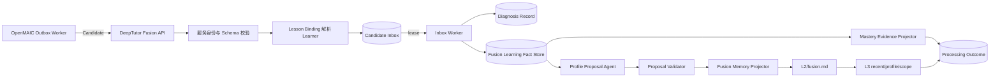

# DeepTutor 自动画像与学习状态流水线

## 1. 文档定位与状态

本文统合“在没有人类主动对话时，DeepTutor 如何由 OpenMAIC Candidate 事件驱动 Agent 自动更新学习状态”的讨论结论。

- 本文是与[文档 `08`](./08-deeptutor-learner-state-and-identity-resolution.md)配套的 DeepTutor 内部处理规范。
- [文档 `06`](./06-post-class-semantic-exchange-protocol.md)是 Candidate/Receipt 跨域协议 SSOT；本文在该边界内承接 Candidate，定义 DeepTutor 内部可靠接收、Fact、Mastery、Agent Proposal 和 Memory 流水线。它消费课后 Candidate，但不隶属于课后跨域协议。
- learner 解析以文档 `08` 为 SSOT；digest/hash 以[文档 `10`](./10-canonical-hash-digest-and-integrity-specification.md)为 SSOT；从当前代码迁移到可靠 Inbox 的路线见[文档 `07`](./07-post-class-fusion-code-migration-roadmap.md)。
- 本文描述的是待实现方案；当前 DeepTutor 尚没有完整的 Candidate Inbox、Fusion Fact Store、后台 Projector 和自动 L2/L3 调度闭环。
- 本文定义逻辑职责、处理语义和推荐物理选型，不把示例字段视为最终 DDL、API 或 Agent prompt。

## 2. 需要补齐的能力

现有“接收 Candidate 并返回 accepted”的接口即使存在，也只能证明请求到达，不能证明：

- Candidate 已经可靠落盘。
- Candidate 已经关联到正确 Learner。
- 外部观察已经转化为 DeepTutor 内部事实。
- Mastery Progress 已经更新。
- L2/L3 Memory 已经 Consolidate。
- Agent 给出的判断已经通过领域规则校验。

因此目标不是在 HTTP 请求里同步调用一次大模型，而是建立一条可恢复、可审计、可重放的后台流水线：

```text
OpenMAIC Candidate
  -> Candidate Inbox（可靠接收）
  -> Lesson Binding（Learner 解析）
  -> Fusion Learning Fact（内部事实）
     ├-> Mastery Evidence Projector（确定性领域更新）
     │   -> Mastery Outcome
     └-> Profile Fact Proposal（受限 Agent 语义判断）
         -> Proposal Validator
         -> Fusion Memory Surface（可审计的画像输入）
         -> L2/L3 Consolidation Outcome
```

Mastery 与长期 Memory/L2-L3 是从同一 `FusionLearningFact` 派生的不同投影结果；Mastery 更新不作为 Profile Agent 或 Memory Consolidation 的隐式前置条件。

## 3. 总体事件驱动架构



关键原则：

1. 接收事务与后续计算分离，课堂结束不等待 Agent 或 L3 更新。
2. Candidate 是外部候选观察，不是内部画像事实，更不是画像写入命令。
3. 所有后台步骤先恢复 Learner 身份并安装用户作用域。
4. 原始事实、Mastery、Memory 和处理状态各有权威载体，不互相冒充。
5. Agent 负责受约束的语义提议；确定性服务负责校验、聚合和提交。

## 4. Confidence 不是一个通用分数

Candidate 中单独出现 `confidence: 0.8` 会混淆“谁对什么有多确定”。目标模型至少区分四类置信度：

| 类型 | 产生方 | 表达含义 | 能否直接更新长期状态 |
| --- | --- | --- | --- |
| `mappingConfidence` | DeepTutor 知识映射 | 外部课堂概念映射到 DeepTutor 权威知识点的可信度 | 否，先通过映射门槛与版本校验 |
| `diagnosisConfidence` | DeepTutor 课中诊断 | 某次诊断判断基于当时证据的可信度 | 否，属于一次诊断记录 |
| `observationConfidence` | 观察证据产生方 | 这条行为或评分观察本身的可靠度 | 否，只是事实元数据 |
| `aggregationConfidence` | DeepTutor 课后聚合 | 多条事实支持某个画像候选结论的总体可信度 | 否，仍需画像策略与冲突校验 |

### 4.1 DeepTutor 课中诊断的置信度

如果观察来源是 `deeptutor_diagnosis`：

- `diagnosisConfidence` 由 DeepTutor 课中诊断产生。
- OpenMAIC 只冻结并回传诊断引用和当时可见值，不重新计算，也不把它变成自己的判断。
- Candidate 应携带 `sourceDiagnosisId`、`sourceEventId` 和 `diagnosisRevision` 等引用。
- DeepTutor 课后处理时重新读取自身持久化的 `DiagnosisRecord`，校验 learner、lesson、revision 和内容摘要；不能只相信回传的 `0.8`。

这要求课中诊断先拥有可查询的持久记录。若只能回传一个无法关联到权威记录的数字，则该数字只能作为低权重外部观察，不能称为 DeepTutor 权威诊断。

### 4.2 OpenMAIC 本地观察的置信度

如果来源是 `openmaic_local`，OpenMAIC 可以描述评分器、规则或采集质量。例如规则评分的 `observationConfidence = 1.0` 只表示“该评分规则对这次答案的判定是确定的”，不表示 learner 已经永久掌握该知识点。

### 4.3 聚合规则

四类 confidence 不相乘成一个看似精确的总分。DeepTutor 应保留每类值、来源、算法版本和缺失原因，由各 Projector 根据自己的门槛使用；Agent 生成的 `aggregationConfidence` 也必须附依据引用，不能覆盖原始 confidence。

## 5. Candidate 接收事务与 Receipt

### 5.1 接收顺序

DeepTutor Fusion API 在一个短事务中完成：

1. 验证 OpenMAIC Worker 的服务身份、audience 和提交权限。
2. 校验 Candidate schema/version、大小限制和必要引用。
3. 根据 `lessonSessionId` 查询有效 `FusionLessonBinding`，解析内部 `learnerSubjectId`。
4. 计算或校验规范化 `payloadHash`。
5. 以 `candidateId` 或 `idempotencyKey` 执行唯一写入。
6. 原子写入 Candidate Inbox 和初始处理状态。
7. 提交成功后返回 Receipt；后台 Worker 再异步处理。

### 5.2 幂等与冲突

- 相同幂等键、相同 hash：返回原 Receipt，不重复创建事实。
- 相同幂等键、不同 hash：拒绝为 `idempotency_conflict`，记录安全告警，不能覆盖原 payload。
- lesson 不存在、已撤销或与 audience 不符：拒绝接收，不允许 payload 自带 learner 绕过。
- 临时数据库故障：返回可重试失败，不能先返回 accepted 再尝试落盘。

### 5.3 Receipt 的严格含义

Receipt 的状态和关联字段遵循文档 `06` 的 `ProfileUpdateReceipt`，本文不重新定义 Receipt enum。为说明接收与下游处理的区别，读取 Receipt 时应按以下语义理解：

```text
rejected       请求未进入权威 Inbox
accepted       Candidate 已可靠持久化，等待或正在处理
queued         Candidate 已可靠持久化，并明确排入后台处理
duplicate      与已接收 Candidate 完全相同
```

Receipt 可以包含 `candidateId`、`receiptId`、`receivedAt` 和查询 Outcome 的 opaque reference，但不返回 learner 标识。

`accepted` 不等于 `processed`，更不等于 `mastery_updated` 或 `profile_updated`。

## 6. CandidateInboxStore 与物理选型

业务代码依赖逻辑端口 `CandidateInboxStore`，而不是依赖某个数据库 SDK：

```text
accept(candidate, binding, payloadHash)
get(receiptId)
leaseNext(workerId, leaseUntil)
renewLease(runId, leaseUntil)
complete(runId, outcome)
scheduleRetry(runId, nextAttemptAt, reason)
deadLetter(runId, reason)
deleteByLearnerOrLesson(scope)
```

### 6.1 Integrated MVP

推荐使用独立 SQLite 数据库，例如 `data/system/fusion.db`，保存 Fusion 系统状态。它与用户 Memory Markdown、Chat Session Store 和 L1 Trace 分离，并通过唯一索引和事务实现可靠接收、lease 与幂等。

这里的路径只是部署建议，不是已确认配置；实现 Feature 需结合 DeepTutor 的路径与备份约定定稿。

### 6.2 PocketBase 部署

若部署形态已经以 PocketBase 为权威持久层，则创建独立 Fusion Collections，并实现同样的逻辑约束、原子写入、lease 和查询语义。

### 6.3 单一权威后端

一个部署只能选择一个 CandidateInboxStore 权威后端。不得把 SQLite 和 PocketBase 设计成“双写成功任一即可”的兜底，否则两边会产生不同的幂等结果和处理状态。

具体部署采用 SQLite、PocketBase 或其他满足同等事务语义的后端仍为待决项；本节只确定能力要求和“单一权威后端”原则。

文件系统离线 Queue、L1 JSONL、Memory Markdown、Chat Session Store 和 `notebook_entries` 都不适合作为 Candidate Inbox，因为它们不能同时可靠提供事务、唯一约束、hash 冲突检测、并发 lease、有限重试、dead-letter、精确删除和多实例恢复。

## 7. 逻辑持久模型

以下是职责级 schema，不是最终 DDL。

### 7.1 `fusion_lesson_bindings`

持久保存 `lessonSessionId -> learnerSubjectId`，模型和规则见文档 08。

### 7.2 `fusion_candidate_inbox`

```text
candidate_id
receipt_id
idempotency_key
payload_hash
schema_version
lesson_session_id
learner_subject_id       # 由 Binding 冻结，只在 DeepTutor 内部
payload_json
status
received_at
attempt_count
next_attempt_at?
last_error_code?
processed_at?
```

### 7.3 `fusion_processing_runs`

```text
run_id
candidate_id
worker_id
status
lease_until
started_at
heartbeat_at
finished_at?
input_revision
projector_versions
outcome_json?
error_code?
```

Processing Run 保存每次尝试；Candidate 的最终状态不能靠覆盖一条模糊错误消息表达。

### 7.4 `fusion_diagnosis_records`

DeepTutor 课中诊断的权威记录，至少能用 `sourceDiagnosisId + revision` 查询，并校验 lesson、learner、来源事实、结构化结论、confidence、模型/规则版本和时间。它可以由现有诊断服务提供，不要求物理上与 Inbox 同库，但必须是持久、可审计的权威来源。

### 7.5 `fusion_learning_facts`

```text
fact_id
candidate_id
observation_id
learner_subject_id
lesson_session_id
knowledge_authority_ref?
observation_kind
value_json
provenance
source_event_id?
source_diagnosis_id?
source_diagnosis_revision?
mapping_confidence?
diagnosis_confidence?
observation_confidence?
mapping_revision?
occurred_at
created_at
```

同一 Candidate/Observation 在相同映射版本下只能生成一个逻辑事实；需要重映射时创建新 revision 或明确 supersede，不能静默改写历史。

## 8. Inbox Worker 状态机

建议状态：

```text
pending
  -> processing
       -> processed
       -> retry_scheduled -> processing
       -> dead_letter
       -> discarded
```

- `pending`：已接收，尚未获得 lease。
- `processing`：某个 Worker 持有有限期 lease。
- `retry_scheduled`：发生可恢复错误，等待有限次数重试。
- `processed`：要求的事实投影完成；具体下游结果记录在 Outcome 中。
- `dead_letter`：超过重试预算或出现需人工处理的异常。
- `discarded`：因撤销、删除或经策略确认不应处理而终止，并记录原因。

Worker 崩溃后，过期 lease 可由其他 Worker 接管；接管只重试幂等步骤。永久 schema 错误、身份冲突、hash 冲突不进行无限重试。退避策略、最大次数和 dead-letter 恢复必须配置且可观测。

## 9. 后台用户作用域

每个 Processing Run 在访问用户数据前执行：

```text
candidate.lessonSessionId
  -> FusionLessonBinding
  -> learnerSubjectId
  -> load internal user
  -> install CurrentUser/UserScope
  -> resolve PathService
  -> run projectors
  -> finally reset user context
```

禁止使用 Candidate 中的 learner 字段。Binding 已撤销、用户已删除或作用域无法安装时，停止下游处理；不得回退到 admin/default workspace。

多 learner 并发任务不得共享进程级可变 CurrentUser。若当前上下文实现无法保证任务隔离，应采用显式 scope 参数、context-local 容器或隔离 Worker，而不是依赖调用顺序。

## 10. 外部 Candidate 到内部事实的映射

Candidate Projection 负责：

1. 校验 observation ID、来源类型、时间和 lesson 归属。
2. 对 `deeptutor_diagnosis` 重新读取权威 DiagnosisRecord。
3. 解析知识点映射和 mapping revision。
4. 规范化答案、评分、行为和错误类型等值。
5. 按 provenance 完整生成不可变 `FusionLearningFact`。
6. 将不满足映射或证据门槛的观察记录为明确的 skipped/rejected outcome，而不是猜测。

### 10.1 为什么不直接复用现有 Quiz/Evidence 表

现有 Quiz/Learning Evidence 可以继续作为具体领域输入或下游目标，但不应承担外部 Fusion 事实的唯一权威载体，因为 Fusion 还需要保存：

- Candidate 与 Observation 的幂等关系。
- lesson 与外部 provenance。
- source diagnosis 引用和 revision。
- 四类 confidence 的不同语义。
- 映射版本、重映射和 supersede 关系。
- 接收、处理和删除的跨系统审计。

因此新增逻辑 `FusionLearningFactStore`。Projector 可以在验证后把符合条件的事实转换为现有 Quiz/Evidence 命令；这属于投影，不是把外部 payload 直接插入旧表。

Session Store、L1 Trace 和 Markdown 同样不是权威 Fact Store：它们分别服务对话历史、best-effort 记忆追踪和人类可读综合，不具备 Fusion 事实的事务与版本语义。

## 11. MasteryEvidenceProjector

Mastery 更新由确定性的领域服务完成：

```text
FusionLearningFact
  -> eligibility policy
  -> normalized mastery evidence
  -> existing Learning/Mastery Service
  -> mastery revision
```

Projector 必须：

- 只接受映射到权威知识点且满足证据门槛的 Fact。
- 以 `factId + projectorVersion` 幂等。
- 保留来源 Fact 引用，支持审计和重算。
- 通过现有 Mastery/Learning Service 执行领域规则，不直接改数据库数值。
- 对一次正确、一次错误或低置信诊断只增加证据，不直接宣称永久掌握或永久薄弱。
- 在 Outcome 中记录 `applied`、`skipped`、`rejected` 及新的 mastery revision。

## 12. 受限 Agent 的职责

Agent 适合处理需要语义归纳的任务，例如：

- 从多条事实识别可能的误区模式。
- 判断新证据与旧画像候选是否冲突。
- 提议稳定画像事实、近期变化或学习范围。
- 产生带依据的 `aggregationConfidence`。

Agent 只返回结构化候选：

```text
ProfileFactProposal
  proposalId
  learnerScope
  targetSlot: recent | profile | scope
  claimType
  claimValue
  supportingFactIds[]
  contradictingFactIds[]
  aggregationConfidence
  rationaleCode
  modelAndPromptRevision
  expiresAt?
```

Agent 不允许：

- 直接写 `mastery_levels`。
- 直接覆盖 L2/L3 Markdown。
- 根据单条 Candidate 永久设置 weak point、偏好或人格特征。
- 读取不属于当前 learner 的 Session、Memory 或知识库。
- 把自然语言输出当作成功提交结果。

Proposal Validator 负责 schema、引用存在性、证据数量、confidence 门槛、敏感字段、冲突策略和允许的 target slot；验证失败的 Proposal 不进入 Memory。

## 13. Fusion Memory Surface 与自动 Consolidation

为避免把 OpenMAIC 对话伪装成 DeepTutor Chat，新增逻辑 Memory `fusion` surface：

```text
FusionLearningFacts + validated ProfileFactProposals
  -> FusionSnapshotAdapter
  -> L1 fusion snapshot/trace
  -> L2/fusion.md
  -> L3/recent.md / profile.md / scope.md
```

`L2/fusion.md` 应是可审计、带事实引用的课堂学习事实整理，不是原始 Candidate JSON，也不是 OpenMAIC 全量对话转存。偏好只有在用户明确表达且满足专门政策时才能进入 preferences；不得从课堂行为随意推断稳定偏好。

后台编排器应直接调用 Memory 服务能力，例如逻辑上的：

```text
refresh_snapshot("fusion")
update_l2("fusion")
update_l3("recent")
update_l3("profile")
update_l3("scope")
```

这不是模拟前端点击，也不是创建虚假聊天 Session。具体方法名需在实现 Feature 中按现有 Memory API 定稿。

### 13.1 调度策略

- Candidate 和 Fusion Fact：立即可靠持久化。
- Mastery：事实满足条件后立即或小批量投影。
- L2 fusion：按 learner debounce 或短时间批处理，减少重复 Consolidation。
- L3 recent/profile/scope：按新证据阈值、时间窗口、显著变化或人工重建请求触发。
- 同一 learner、同一 L3 slot 同时只能有一个 consolidation lease。
- 不为每个 Candidate 在接收请求内同步运行完整 L3。

## 14. 幂等、并发和失败恢复

每个阶段拥有独立幂等键和 revision：

| 阶段 | 推荐幂等维度 |
| --- | --- |
| Candidate 接收 | `idempotencyKey + payloadHash` |
| Fact Projection | `candidateId + observationId + mappingRevision` |
| Mastery Projection | `factId + masteryProjectorVersion` |
| Agent Proposal | `factSetHash + proposalPolicyRevision` |
| L2 Consolidation | `learner + fusionSnapshotRevision` |
| L3 Consolidation | `learner + slot + sourceRevisionSet` |

规则：

- Worker 和 Projector 按“至少一次执行、效果幂等”设计。
- Candidate processed 不因 L3 暂时失败而回滚已经提交的 Fact 或 Mastery；各下游状态分别记录并可重试。
- 同一 learner 的 Mastery 路径或 L3 slot 使用乐观 revision 或 lease 防止丢失更新。
- Agent 超时、限流或输出非法属于可隔离失败，不能阻塞事实入库。
- 重放必须指定 Projector/Policy 版本，并记录新旧 Outcome，不静默改写历史。

## 15. 完成语义与 Outcome

应将接收状态与下游成果拆开查询：

```text
CandidateReceipt
  acceptanceStatus

CandidateProcessingOutcome
  factProjectionStatus
  masteryProjectionStatus
  proposalStatus
  memoryL2Status
  memoryL3Status
  revisions
  warnings[]
```

推荐完成语义：

- `accepted`：Inbox 事务已提交。
- `facts_projected`：合格 Observation 已形成内部 Fact；可能有部分 Observation 被跳过。
- `mastery_applied`：Mastery Projector 已提交并返回 revision。
- `memory_l2_updated`：Fusion L2 已更新。
- `memory_l3_updated`：指定 L3 slot 已更新。
- `processed_with_warnings`：必需步骤完成，某些非必需 Projection 被跳过或失败。
- `dead_letter`：处理无法自动完成，需要人工处置。

不得用一个 `success: true` 同时代表以上所有状态。

## 16. 数据生命周期、撤销与删除

Learner 删除、lesson 删除或合法撤回必须沿引用链执行：

```text
LessonBinding
  -> Candidate Inbox
  -> Processing Runs
  -> Fusion Learning Facts
  -> Diagnosis references
  -> Mastery evidence/projection references
  -> Fusion L1/L2/L3 derived content
```

- 删除操作由 DeepTutor 内部 learner subject 或受权 lesson scope 发起，不信任 Candidate 自报身份。
- 原始 payload、Facts、Agent Proposal 和派生画像可有不同保留期，但必须有明确政策。
- 删除过程中禁止新 Worker 获得相关 lease。
- 对已经进入聚合文档的内容，需要重建受影响的 L2/L3，而不只是删除 Inbox 行。
- 审计日志只保留政策允许的脱敏引用，不借审计之名永久保存被删除的学习内容。

## 17. 可观测性与人工恢复

至少提供：

- 按 Receipt/Candidate 查询各阶段 Outcome。
- pending、lease expired、retry、dead-letter 数量和最老等待时间。
- 身份解析失败、幂等 hash 冲突、Diagnosis revision 不符、知识映射失败告警。
- 按 Projector/Agent/Consolidator 版本统计成功率和耗时。
- 有权限的人工入口用于检查 dead-letter、修复映射后重放、放弃处理和触发用户画像重建。

人工恢复操作必须产生审计记录；不能允许运维人员直接编辑 L3 Markdown 来伪造流水线成功。

## 18. 推荐实施切片

本文不执行实现。后续代码 Feature 可按以下依赖顺序拆分：

1. `FusionLessonBinding` 与服务身份接收边界。
2. `CandidateInboxStore`、Receipt、幂等冲突与 Worker lease。
3. `FusionLearningFactStore`、DiagnosisRecord 校验与 Candidate Projector。
4. `MasteryEvidenceProjector` 及现有 Learning/Mastery Service 适配。
5. 受限 `ProfileFactProposal` Agent、Validator 与回归样本。
6. Fusion Snapshot/L2 Surface 和自动调度。
7. L3 阈值调度、并发控制、删除重建和运营恢复入口。

每个切片都应有独立的失败注入、重启恢复、跨 learner 隔离、幂等重放和删除测试，不能只验证 happy path。

## 19. 待实现 Feature 定稿

- SQLite 与 PocketBase 部署形态的最终选择及事务能力验证。
- 最终表/Collection DDL、索引、备份和迁移策略。
- Candidate schema、payload 上限、Receipt/Outcome API。
- DiagnosisRecord 的现有载体或新增接口。
- 各类 confidence 的取值范围、缺省值和领域阈值。
- Mastery evidence 的领域转换规则与可重算策略。
- Agent 模型、prompt、结构化输出 schema、评估集和成本预算。
- L2/L3 调度阈值、保留期、删除 SLA 和人工恢复权限。
- 四类 confidence 到文档 `06` Candidate wire 字段及文档 `10` digest profile 的最终映射；不得在未定稿前压缩成一个通用总分。
