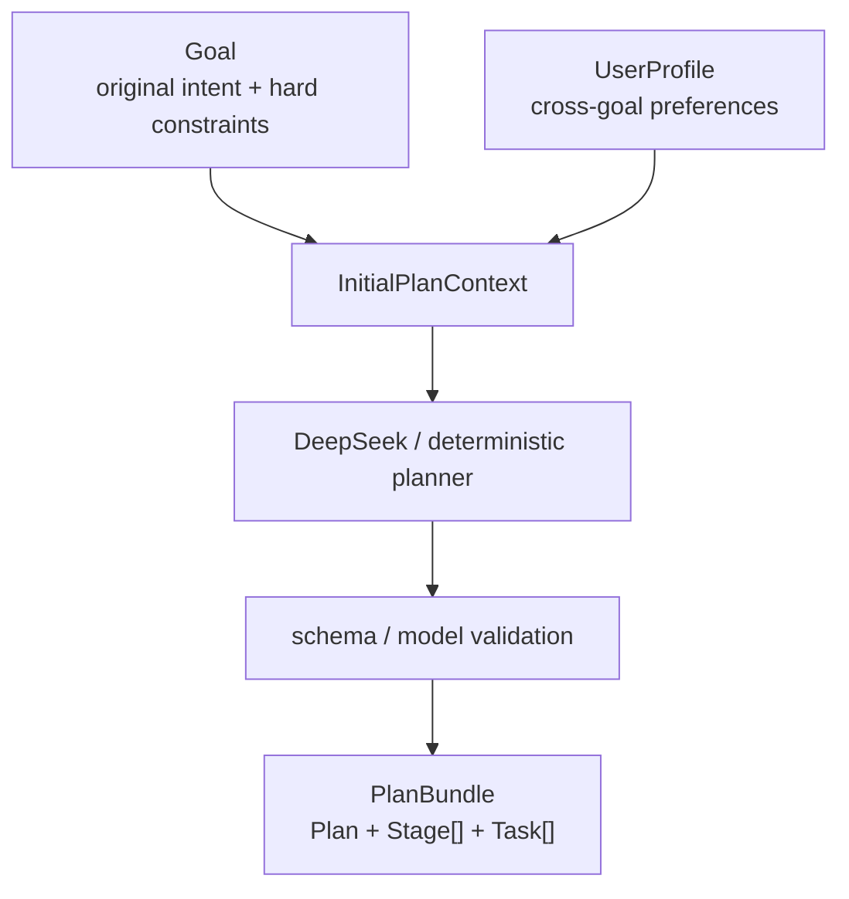
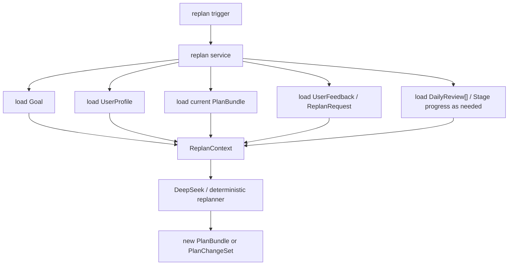

# Goal / Plan / Stage / Task target model contract

## Purpose

This document is the F40 target data model contract for the planning domain.
Future data model migration should use this document as the source of truth before changing `models/`, planner, replanner, storage, or page data consumption.

F40 is a model and migration-direction review. It does not delete `DailyPlan[]`, does not change storage keys, does not change compatibility reads, and does not implement AI or planner rewrites.

F41 implements the F40 target additions in the pure `models/` layer. Planner/replanner behavior, AI integration, storage migration, UI/view-model consumption, and `DailyPlan[]` deletion remain later work.

## F40 conclusion

The target core chain is clear:

```text
Goal + UserProfile
  -> InitialPlanContext
  -> PlanBundle(Plan + Stage[] + Task[])

Goal + UserProfile + current PlanBundle + UserFeedback / DailyReview / Stage progress
  -> ReplanContext
  -> new PlanBundle or PlanChangeSet
```

Key decisions:

- `Goal` is the user's original goal intent and goal-scoped hard constraints.
- `UserProfile` is cross-goal user context and expression/scheduling preference.
- `InitialPlanContext` and `ReplanContext` are transient planner inputs, not persistent core domain models.
- `PlanBundle` is the core persistent planning aggregate.
- `DailyReview` is execution history/fact and may inform replanning, but must not be rewritten by replanning.
- `DailyPlan[]` is not part of the future core domain model. It remains only as legacy storage/adapter compatibility until a separate breaking migration or repair feature removes it.

## Model layers

```text
Persistent truth:
Goal
UserProfile
PlanBundle
  ├── Plan
  ├── Stage[]
  └── Task[]
DailyReview[]
TodayTaskSelection[]
DailyReviewPromptDismissal[]
PlanChangeSummary[]

Transient planner input:
InitialPlanContext
ReplanContext

Computed view:
DailyTaskView
TodaySuggestionView
PlanBundleCalendarView

Legacy compatibility:
DailyPlan[]
```

## Initial planning flow

Initial planning creates the first `PlanBundle` from user intent and reusable user context.
It must not depend on `DailyReview[]` because no execution history exists yet.



Target shape:

```ts
export interface InitialPlanContext {
  goal: Goal
  userProfile?: UserProfile
  today: string
}
```

Rules:

- `InitialPlanContext` is assembled by service code at runtime.
- It is allowed to include only data that exists before the first plan is generated.
- It is not stored as a separate long-lived model.
- DeepSeek input may use a compressed AI-specific schema derived from this context.
- AI output must be validated before it becomes a `PlanBundle`.

## Replanning flow

Replanning updates or replaces the current plan when reality diverges from the existing plan.

Triggers include:

- user rejects or dislikes the generated plan;
- user gives free-form plan feedback;
- a stage is completed and the next stage needs refinement;
- daily review shows partial/skipped work;
- capacity or deadline changes;
- the current plan becomes infeasible.



Target shape:

```ts
export type ReplanReason =
  | 'user_rejected_plan'
  | 'user_feedback'
  | 'stage_completed'
  | 'daily_review'
  | 'execution_progress'
  | 'capacity_changed'
  | 'deadline_changed'
  | 'plan_infeasible'

export interface ReplanContext {
  goal: Goal
  userProfile?: UserProfile
  currentPlanBundle: PlanBundle
  reason: ReplanReason
  today: string
  userFeedback?: UserPlanFeedback
  dailyReviews?: DailyReview[]
  completedStageId?: string
}

export interface UserPlanFeedback {
  id: string
  goalId: string
  planId: string
  message: string
  createdAt: string
}
```

Rules:

- `currentPlanBundle` is read from storage and injected into `ReplanContext` by service code.
- `ReplanContext` is a transient input object, not a persistent truth source.
- Deterministic replanner may consume the full `PlanBundle`.
- AI replanner should receive an explicit `ReplanAiInput` derived from `ReplanContext`, usually compressed to current stage, unfinished tasks, completed facts, and user feedback.
- Replanning must preserve completed task facts and historical `DailyReview[]`.
- Replanning must not silently discard unfinished tasks.
- If replanning cannot produce a feasible plan before the deadline, it must return an explicit infeasible result.

## Goal

`Goal` is the user's original intent and goal-scoped hard constraints.

It answers: what does the user want, what counts as done, what is the deadline, and how much time can this user allocate to this specific goal.

Pre-F41 implemented shape:

```ts
export type GoalStatus = 'draft' | 'active' | 'completed' | 'archived' | 'cancelled'
export type GoalTaskType =
  | 'study_exam'
  | 'writing_report'
  | 'project_development'
  | 'creative_work'
  | 'habit_building'
  | 'organizing_admin_life'
  | 'other'

export interface Goal {
  id: string
  title: string
  taskType?: GoalTaskType
  description?: string
  deadline: string
  dailyAvailableMinutes: number
  status: GoalStatus
  createdAt: string
  updatedAt: string
}
```

F40 target additions, implemented in the model layer by F41:

```ts
export interface Goal {
  id: string
  title: string
  description?: string
  originalInput?: string
  successCriteria?: string
  scopeNotes?: string
  startingPoint?: string
  constraints?: string[]
  deadline: string
  dailyAvailableMinutes: number
  status: GoalStatus
  createdAt: string
  updatedAt: string
}
```

F65 additive extension:

```ts
export interface Goal {
  preferredApproach?: string
}
```

F73 additive risk extension:

```ts
export type PlanAdjustmentRisk = 'risk' | 'infeasible'

export interface Plan {
  adjustmentRisk?: PlanAdjustmentRisk
}
```

`adjustmentRisk` is present only while `status = 'needs_adjustment'`. It preserves whether the unresolved condition is a cautionary capacity risk or a proven deadline infeasibility; legacy `needs_adjustment` Plans without the field conservatively fall back to `infeasible`.

`preferredApproach` is a Goal-scoped soft preference such as “start from the most familiar chapter”.
It must come from user wording, a confirmed clarification answer, or explicit user supplementation.
It does not override the deadline, daily capacity, or explicit hard constraints, and it must not be inferred from MBTI, tarot, state cards, or behavior profiling.

Field intent:

- `originalInput`: the user's raw wording, useful for AI semantic context.
- `taskType`: the user's selected category for template, prompt, and plan-shape guidance.
- `successCriteria`: what must be true for this goal to be considered complete.
- `scopeNotes`: what is in scope or out of scope for this goal.
- `startingPoint`: the user's current level, assets, blockers, or baseline state for this goal.
- `constraints`: goal-specific hard constraints beyond deadline and daily capacity.

Rejected for `Goal`:

- MBTI, tarot preference, ritual tone, and expression style. These belong to `UserProfile`.
- Daily execution feedback. This belongs to `DailyReview` and enters only replanning context.
- Generated plan strategy. This belongs to `Plan`.
- Page display copy. This belongs to computed views.

Rules:

- One `Goal` may have multiple historical `Plan` versions, but at most one active plan at a time.
- `dailyAvailableMinutes` is a goal-scoped planning constraint and must be a positive integer.
- `dailyAvailableMinutes` is a plan-generation daily budget, not a promise that the user will work exactly that long every day.
- F58 creation starts from goal wording, deadline, and daily budget. `taskType`, `successCriteria`, and `startingPoint` are added only when explicitly extracted from the wording, confirmed through intent clarification, or disclosed as assumptions.
- Goal completion is determined at the goal level, not by one task automatically completing.
- Goal cancellation must explicitly handle related Plan, Stage, Task, and Review records.

## UserProfile

`UserProfile` is cross-goal reusable user context.

It answers: how does the user generally prefer to work or receive task expression.

Current implemented shape:

```ts
export interface UserProfile {
  id: string
  energyLevel: EnergyLevel
  mbti?: string
  workStyle: WorkStyle
  preferredFocusMinutes: number
  ritualPreference: RitualPreference
  updatedAt: string
}
```

Boundary:

- Scheduling preferences: `workStyle`, `preferredFocusMinutes`, default `energyLevel`.
- Expression preferences: `mbti`, `ritualPreference`, personalized tone.
- `energyLevel` in `UserProfile` is only a default or current preference. Actual execution-day energy belongs to `DailyReview.energy`.
- MBTI and ritual preferences may affect expression and light ordering only. They must not be treated as scientific prediction, diagnosis, or hard task decision evidence.

## PlanBundle

`PlanBundle` is the core persistent plan aggregate for one generated plan.

```ts
export interface PlanBundle {
  plan: Plan
  stages: Stage[]
  tasks: Task[]
}
```

Rules:

- `PlanBundle` is the primary output of initial planning and replanning.
- Pages should consume service/view-model outputs derived from `PlanBundle`, not raw storage structures.
- A `PlanBundle` must be JSON serializable.
- IDs are stable and must not depend on title text.

## Plan

`Plan` is the metadata and strategy record for a generated plan.

It answers: which goal this plan belongs to, whether it is feasible, how it was generated, and why this arrangement exists.

Pre-F41 implemented shape:

```ts
export type PlanStatus =
  | 'draft'
  | 'active'
  | 'needs_adjustment'
  | 'infeasible'
  | 'completed'
  | 'archived'

export interface Plan {
  id: string
  goalId: string
  status: PlanStatus
  startDate: string
  deadline: string
  dailyAvailableMinutes: number
  createdAt: string
  updatedAt: string
}
```

F40 target additions, implemented in the model layer by F41:

```ts
export type PlanGenerationSource = 'deterministic' | 'deepseek' | 'manual'

export interface Plan {
  id: string
  goalId: string
  status: PlanStatus
  version: number
  generationSource: PlanGenerationSource
  generatedAt: string
  generationReason: 'initial' | ReplanReason
  strategySummary?: string
  feasibilitySummary?: string
  infeasibleReason?: string
  replannedFromPlanId?: string
  startDate: string
  deadline: string
  dailyAvailableMinutes: number
  createdAt: string
  updatedAt: string
}
```

F65 additive extension:

```ts
export type PlanStructureType = 'sequential' | 'flexible' | 'hybrid'

export interface Plan {
  structureType?: PlanStructureType
  detailedThrough?: string
}
```

Rules:

- A missing `structureType` preserves the legacy staged-plan contract and does not fabricate a user preference.
- `detailedThrough` is the last date for which concrete Tasks have been generated.
- When `detailedThrough` exists, it must stay within `startDate` and `deadline`, and strict PlanBundle validation rejects Tasks after it.
- A missing `detailedThrough` preserves legacy plans that already contain concrete Tasks across their full date range.

F67 initial-planning contract:

- New successful initial plans require `structureType` and `detailedThrough`.
- `detailedThrough = min(deadline, today + 6 calendar days)`.
- Stage ranges cover the full Plan window, including today and the deadline.
- Concrete Tasks exist only on or before `detailedThrough`; later dates remain Stage-level direction rather than fabricated daily facts.
- Stage `estimatedMinutes` represent whole-cycle work and may exceed the sum of currently materialized Tasks.
- Total Stage minutes must fit `inclusive plan days * dailyAvailableMinutes`.
- Every initial Task belongs to one Stage and its scheduled date stays inside that Stage range.
- AI dependency client keys are transient conversion identifiers; persisted dependencies use `Task.dependsOnTaskIds`.
- Initial AI Task ids are stable by `planId + clientTaskKey` and do not depend on title or output array order.

Rules:

- `Plan` should carry traceable summary metadata, not the full prompt or full transient context.
- `Plan.status = 'infeasible'` must be explicit when the goal cannot fit within deadline/capacity.
- Replanning may create a new plan version or return a controlled change set, but it must preserve historical facts.
- A later normal adjustment cannot clear, upgrade or downgrade an unresolved `adjustmentRisk` without explicitly re-establishing feasibility; combined risks keep the more severe level.
- AI must not directly mutate an existing plan in storage. Service code validates and applies results.

## Stage

`Stage` is a long-range phase within a plan.

It answers: for goals longer than the near-term task horizon, what phase is the user currently working through and what outcome should that phase produce.

Pre-F41 implemented shape:

```ts
export type StageStatus = 'planned' | 'active' | 'completed' | 'skipped'

export interface Stage {
  id: string
  goalId: string
  planId: string
  title: string
  startDate: string
  endDate: string
  status: StageStatus
  order: number
  createdAt: string
  updatedAt: string
}
```

F40 target additions, implemented in the model layer by F41:

```ts
export interface Stage {
  id: string
  goalId: string
  planId: string
  title: string
  purpose?: string
  outcome?: string
  scopeNotes?: string
  startDate: string
  endDate: string
  status: StageStatus
  order: number
  createdAt: string
  updatedAt: string
}
```

F65 additive extension:

```ts
export interface Stage {
  estimatedMinutes?: number
}
```

`Stage.estimatedMinutes` is a positive-integer coarse workload estimate for the whole phase or workstream.
It is not required to equal the sum of the currently materialized near-term Tasks.

Rules:

- Stage is for long-range overview and refinement; it does not replace near-term `Task`.
- Stage completion does not automatically complete the `Goal`.
- Stage completion may trigger replanning for future stages/tasks.
- Stage date ranges must stay within the parent plan date range.

## Task

`Task` is the smallest executable planning unit.

It answers: what should the user do on a specific day, how long it should take, and what the minimum acceptable completion line is.

Pre-F41 implemented shape includes legacy `date` and target `scheduledDate`:

```ts
export type TaskType = 'focus' | 'support' | 'buffer' | 'review'
export type TaskStatus = 'todo' | 'done' | 'partial' | 'skipped'
export type TaskPriority = 'high' | 'medium' | 'low'

export interface Task {
  id: string
  goalId: string
  planId?: string
  stageId?: string
  title: string
  description?: string
  date: string
  scheduledDate: string
  estimatedMinutes: number
  priority: TaskPriority
  type?: TaskType
  status: TaskStatus
  minimumLine: string
  focusSuggestion?: string
  caution?: string
  createdAt?: string
  updatedAt?: string
}
```

F40 target shape, enforced by strict Task validation in F41:

```ts
export interface Task {
  id: string
  goalId: string
  planId: string
  stageId?: string
  title: string
  description?: string
  scheduledDate: string
  estimatedMinutes: number
  priority: TaskPriority
  type: TaskType
  status: TaskStatus
  minimumLine: string
  focusSuggestion?: string
  caution?: string
  rescheduledFromDate?: string
  rescheduledFromStatus?: Extract<TaskStatus, 'partial' | 'skipped'>
  rescheduleReason?: TaskRescheduleReason
  createdAt: string
  updatedAt: string
}
```

F65 additive extension:

```ts
export interface Task {
  dependsOnTaskIds?: string[]
}
```

Dependency rules:

- Every dependency must reference a Task in the same PlanBundle.
- Self dependencies, duplicate references, missing references, and cycles are invalid.
- A dependency is satisfied only when the referenced Task status is `done`.
- `todo`, `partial`, and `skipped` dependencies remain unmet.
- Schedule order alone is not a dependency. Users may execute another available Task without invalidating the Plan.

Rules:

- `Task.id` must be stable and must not depend on `title`.
- `Task.scheduledDate` is the target execution date.
- `Task.date` is legacy only and should not constrain new model design.
- Multiple tasks may share the same `scheduledDate`.
- `estimatedMinutes` must be a positive integer.
- The total task minutes for one day must not exceed the plan's `dailyAvailableMinutes`.
- `minimumLine` is required and must remain explicit.
- Task completion does not equal goal completion.
- Task skip does not equal goal cancellation.

## Task Card computed contract

F65 adds a pure selector that derives Task Card facts from a PlanBundle:

```ts
export type TaskCardAvailability = 'available' | 'locked' | 'closed'

export interface TaskCardView {
  taskId: string
  stageId?: string
  availability: TaskCardAvailability
  isRecommended: boolean
  unmetDependencyTaskIds: string[]
}
```

Rules:

- `done` Tasks are `closed`.
- An unfinished Task with at least one unfinished explicit dependency is `locked`.
- Other `todo`, `partial`, and historical `skipped` Tasks are `available`.
- The default candidate window ends on the target date; callers may explicitly broaden the date range for later task-selection features.
- Future schedule dates do not become hard locks when the caller deliberately includes them.
- The single recommendation is deterministic by `scheduledDate`, priority, then stable Task id.
- The selector does not read storage, call AI, write recommendation facts, or mutate the PlanBundle.

## FocusSession, TaskResult and DailyReview

Focus timing, task execution result and daily review are separate domain concepts even when a UI later connects them in one execution flow.

`FocusSession` answers: how long did one concrete focus process run. It belongs to exactly one Goal/Plan/Task, is persisted when started, and has the state machine `running -> paused -> running -> completed` with `cancelled` as a terminal alternative. Wall-clock time is recovered from timestamps and capped at the target duration, so process absence does not depend on a live page interval.

`TaskResult` answers: what actually happened to one Task during execution.

Persisted `TaskResult` information includes:

- stable `taskId`, `goalId`, and `planId` ownership;
- execution date;
- result status: `done`, `partial`, or `skipped`;
- unique completed FocusSession references, derived timed seconds, and user-confirmed manual minutes;
- task effort rating (`lighter`, `expected`, or `harder`);
- an optional task-scoped note;
- creation/update timestamps.
- an optional status-change timestamp used only to distinguish a real status transition from a same-status save retry; legacy records fall back to creation time.

`DailyReview` answers: what the day was like overall.

It owns day-scoped information such as workload feedback and an optional daily note, and may reference or summarize the Task results recorded for that date. A multi-task day may have many Task results but only one DailyReview per Goal/date. `planId`, when present, records the Plan context that produced the reviewed results; it does not create a second Review slot for the same day.

Current compatibility boundary:

- The current model embeds task outcomes in `DailyReview.taskResults` and also exposes the legacy completed/partial/skipped id arrays.
- The single-task “记录进展” interaction may submit Task result fields and DailyReview fields together through one application service transaction.
- This UI and transaction convenience does not make the two concepts identical.
- F61 introduces dedicated Goal-scoped `FocusSession[]` and `TaskResult[]` storage while preserving the embedded Review fields for compatibility.

Rules:

- A focus timer/session produces task-scoped execution evidence; it is not itself a DailyReview.
- Task status and actual invested minutes must not be stored as day-level energy.
- Daily energy must not be copied onto every Task result unless a future feature explicitly introduces task-scoped energy.
- Replanning may read both concepts but must preserve committed execution history.
- `TaskResult.status = skipped` means “今日未完成”; it does not cancel the Task.
- Saving a TaskResult updates the corresponding current PlanBundle Task status through one storage-orchestrated paired write with snapshot rollback.
- DailyReview is not required for either FocusSession or TaskResult to remain valid execution facts.

## TodayTaskSelection

`TodayTaskSelection` answers: which existing Task has the user decided to execute on one concrete date.

```ts
export interface TodayTaskSelection {
  id: string
  goalId: string
  planId: string
  date: string
  taskId: string
  source: 'ai_recommended' | 'user_selected'
  selectedAt: string
  updatedAt: string
}
```

Rules:

- One Goal/Plan/date has at most one selection.
- A selection references a Task in the current active PlanBundle.
- A future Task may be selected only through the bounded near-term candidate service and only when its explicit dependencies are satisfied.
- Cross-Stage selection is allowed; Stage order alone is not authorization or a lock.
- A selection can authorize execution before `Task.scheduledDate`, but never rewrites that date.
- `FocusSession.date` and `TaskResult.date` store the real execution date.
- Old-date and old-Plan selections remain history and cannot authorize a different date or current Plan.
- A selection is not a TaskResult, DailyReview, Replan, or statement that the plan schedule changed.

## DailyReview

`DailyReview` is day-scoped execution history.

It answers: what actually happened on a day.

Target shape:

```ts
export interface DailyReview {
  id: string
  goalId: string
  planId: string
  date: string
  energy?: EnergyLevel
  taskResults: Array<{
    taskId: string
    status: Extract<TaskStatus, 'done' | 'partial' | 'skipped'>
  }>
  note?: string
  createdAt: string
  updatedAt?: string
  workloadRating?: 'light' | 'balanced' | 'heavy'
  taskResultIds?: string[]
}
```

Compatibility:

- Current code still exposes `completedTaskIds`, `partialTaskIds`, and `skippedTaskIds`.
- These legacy arrays may be normalized into `taskResults`.
- Existing `energy` and embedded `taskResults` remain compatibility fields until a separate migration removes them.
- A new workload-based Review may omit legacy `energy`; compatibility views may use a display fallback but must not persist that fallback as a user fact.
- A DailyReview draft may contain objective TaskResult summaries but must not invent workload feedback or a note.

Rules:

- DailyReview is historical fact.
- Replanning may read DailyReview but must not silently rewrite it.
- Review notes are private user data and must not be logged or uploaded by default.

## DailyReviewPromptDismissal

`DailyReviewPromptDismissal` is UI prompt history, not execution or review truth.

```ts
export interface DailyReviewPromptDismissal {
  goalId: string
  planId: string
  executionDate: string
  dismissedAt: string
}
```

Rules:

- One Goal/Plan/executionDate has at most one dismissal.
- A dismissal means the user explicitly skipped that Yesterday Summary prompt; it must not create an empty DailyReview or infer workload/note.
- Eligibility is limited to the current Goal/current Plan's most recent TaskResult date before today.
- Historical dismissals cannot authorize, edit or suppress a different Goal/Plan/executionDate.
- Goal deletion removes the Goal-scoped dismissal collection.

## PlanChangeSummary

`PlanChangeSummary` is a persisted receipt explaining one deterministic adjustment; it is not a second Plan truth source.

Target shape:

```ts
interface PlanChangeSummary {
  id: string
  goalId: string
  planId: string
  triggerType: 'task_result' | 'daily_review'
  triggerId: string
  triggerFingerprint: string
  reason: 'progress_recorded' | 'workload_reviewed'
  completedEarlyTaskIds: string[]
  movedTasks: Array<{ taskId: string; fromDate: string; toDate: string }>
  retainedTaskIds: string[]
  satisfiedTaskIds: string[]
  deadlineImpact: 'none' | 'risk' | 'infeasible'
  message: string
  createdAt: string
  acknowledgedAt?: string
}
```

Rules:

- One Goal/Plan/trigger fingerprint has at most one summary; a duplicate retry returns the existing receipt and does not replan.
- The summary references stable Task ids and dates but never copies private TaskResult/DailyReview notes.
- `satisfiedTaskIds` remain completed Tasks in Plan history; “satisfied” does not mean physical deletion.
- `retainedTaskIds` make unchanged unfinished work explicit so it cannot be silently lost.
- `acknowledgedAt` means the user consumed the Today notice. Acknowledgement does not delete history or change Plan facts.
- A TaskResult trigger may adjust only its current Plan's unfinished work. A DailyReview trigger may use only the explicit workload rating.
- PlanBundle + summary persistence is atomic. DailyReview-triggered persistence additionally includes the Review in the same transaction.
- Replanner remains pure and deterministic; storage/orchestration belongs to services outside `replanner.ts`.

## DailyPlan legacy boundary

`DailyPlan[]` does not belong to the future core domain model.

Current role:

- legacy persisted daily plan shape;
- compatibility read/write surface for existing pages or older data;
- adapter input/output while migration is incomplete.

Future role:

- deleted by a separate breaking migration / repair feature after service and page consumers no longer need it.

Rules:

- F40 records the deletion direction only.
- F40 does not delete `DailyPlan[]` code.
- F40 does not change `daily-plans:{goalId}` storage key.
- F40 does not change compatibility reads or adapters.
- New features must not expand `DailyPlan[]` as a truth source.

Known migration risks:

- `models/plan.ts` still defines `DailyPlan` and adapter functions.
- planner still has legacy DailyPlan output paths.
- storage still reads/writes `daily-plans:{goalId}`.
- plan-view and some pages still consume DailyPlan-compatible APIs.

## Computed views

Computed views are not persistent truth.

Examples:

```ts
export interface DailyTaskView {
  date: string
  goalId: string
  planId: string
  tasks: Task[]
  totalEstimatedMinutes: number
  statusSummary: string
}
```

Rules:

- Page-facing data should be generated by services/selectors from `PlanBundle`, `DailyReview`, and `UserProfile`.
- Pages must not directly assemble long-term plan state from raw storage.
- Today suggestions may alter display priority or copy, not core plan facts.

## Migration direction

The migration path after F40 should be split into later features:

1. Extend model code for F40 target fields on `Goal`, `Plan`, `Stage`, and `Task`.
2. Define DeepSeek initial planner input/output schemas from `InitialPlanContext`.
3. Define replanner input/output schemas from `ReplanContext`.
4. Update deterministic planner to produce richer `PlanBundle` as fallback.
5. Replace service/view/page dependencies on `DailyPlan[]` with `PlanBundle`-derived views.
6. Add a breaking migration / repair feature to remove `DailyPlan[]` and old storage key after consumers are migrated.

Do not treat these later steps as part of F40.

## Historical notes

### 2026-05-26 F16

- Task added optional reschedule tracking fields: `rescheduledFromDate`, `rescheduledFromStatus`, `rescheduleReason`.
- Partial/skipped follow-up is represented by updating the same task's `scheduledDate`; historical facts remain in `DailyReview.taskResults`.

### 2026-06-26 F39

- F39 added strict model validation functions alongside compatibility normalizers.
- F39 did not answer whether the model was semantically sufficient for planning.
- F40 supersedes F39's narrow validation focus for future model and migration direction.

### 2026-06-27 F41

- Goal, Plan, Stage, Task validation and normalization now cover the F40 target additions in the pure model layer.
- `InitialPlanContext`, `ReplanContext`, `ReplanReason`, and `UserPlanFeedback` now exist as model-layer runtime input types.
- `DailyPlan[]`, `Task.date`, legacy review id arrays, storage keys, and compatibility adapters remain in place.

### 2026-07-03 F56

- `Goal.taskType` is implemented as an optional model field for preview-first goal creation.
- F56 creation UI requires `taskType`, `successCriteria`, and `startingPoint`, but old stored goals remain valid without them.
- Initial plan preview candidates are transient service/session data. They are not persistent truth and must not affect Today or Calendar before confirmation.

### 2026-07-09 F58

- The first creation screen now requires only goal wording, deadline, and daily planning budget.
- Intent questions, answers, and assumptions are transient planner input, not persistent domain truth.
- Confirmed answers may enrich the temporary Goal candidate before preview generation.
- The current formal confirmation path writes `Goal`, `UserProfile`, and `PlanBundle`; it no longer emits a new legacy daily-plan copy.
